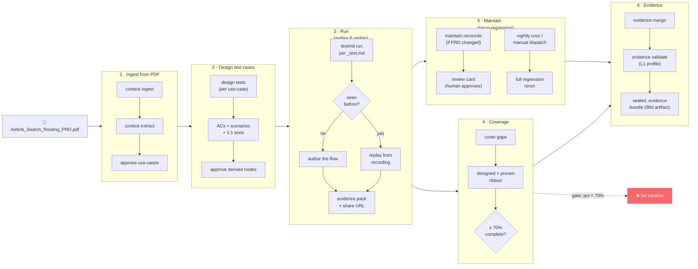

# Airbnb Assurance Flow

A requirements-to-evidence assurance pipeline built with [`kane-cli`](https://www.npmjs.com/package/@testmuai/kane-cli) for the Airbnb Search & Routing PRD. A PDF requirements doc goes in one end; a sealed, auditable evidence pack comes out the other, with every acceptance criterion traced through a designed test to a proven (or failed) run.

## What's in the repo

| Path | What it is |
|---|---|
| `Airbnb_Search_Routing_PRD.pdf` | The source requirements doc |
| `.context/` | The assurance graph — sources, use-cases, ACs, scenarios, tests, and the review/commit history that produced them |
| `.testmuai/tests/*_test.md` | The designed, runnable tests (1:1 with committed test nodes in the graph) |
| `.testmuai/variables/airbnb.json` | Runnable test data (`{{homepage_url}}`, `{{check_in_date}}`, …) |
| `.testmuai/evidence/*.evidence` | Sealed evidence packs from past runs |
| `.github/workflows/assurance-pipeline.yml` | The 6-stage CI pipeline |
| `.github/actions/kane-setup/` | Composite action: installs kane-cli + Chrome, authenticates |
| `.github/scripts/` | Helper scripts the workflow calls (auto-approve, design loop, test runner) |

## The flow



Stage 3 is where the "author once, replay forever" model pays off: the first CI run against a new test authors it live (an LLM-driven agent actually drives the browser); every run after that replays the recorded steps deterministically — no LLM cost, no flakiness from re-reasoning — until the test's prose or an earlier step changes, which invalidates and re-authors from that point down.

## Stage-by-stage

1. **Ingest from PDF** — `kane-cli context ingest <pdf> --mode ci` lands the source, `context extract` proposes use-cases from it, and a script auto-approves them (nobody's watching an interactive review chat in CI).
2. **Design test cases** — walks every use-case the coverage ribbon flags as incomplete and runs `kane-cli design tests --use-case <id>`, which proposes ACs, scenarios, and a 1:1 test per scenario, then auto-approves the new nodes.
3. **Run (author and replay)** — `kane-cli testmd run` over every `*_test.md`. Pass/fail, duration, and a Test Manager share URL land in the job summary; every evidence pack produced is staged for stage 6.
4. **Coverage** — `kane-cli cover gaps` reports the dual-axis ribbon (% of ACs with a live, passing test vs. % of use-cases fully designed). The job fails the pipeline if completeness drops below 70%.
5. **Maintain (rerun-regression)** — on a nightly cron or manual dispatch: optionally reconciles the graph against an updated PRD (`maintain reconcile`, which only *stages* a plan — nothing commits without a human review), then reruns the entire suite as a regression pass.
6. **Evidence** — merges every evidence pack from stages 3 and 5 into one sealed pack (`kane-cli evidence merge`), validates it (`evidence validate --profile L1`), and uploads it as a 90-day CI artifact — the audit trail for "what did we actually prove, and when."

## Running it

Defaults to two repo secrets (Settings → Secrets and variables → Actions) — reused from the existing LambdaTest credentials:

- `LT_USERNAME`
- `LT_ACCESS_KEY`

A manual run (**Actions → KaneAI Assurance Pipeline → Run workflow**) can override either one for that run only, via the `lt_username` / `lt_access_key` inputs — useful for testing against a different account without touching repo secrets. Leave both blank to fall back to the repo secrets. Both values are explicitly masked in the logs the moment the job starts, whichever source they came from.

### Manual-run inputs

All optional — leave blank for the defaults below:

| Input | Default when blank | Purpose |
|---|---|---|
| `pdf_path` | every `*.pdf` at the repo root | Ingest one specific PRD instead of (or in addition to, on a later run) the PDF already committed to the repo |
| `max_tests` | no ceiling — kane-cli estimates the budget itself | Caps the number of scenario+test pairs `design tests` generates per use-case, via kane-cli's own `--max` flag |
| `test_limit` | run every designed test | Caps how many tests stage 3 runs (first N, sorted) — the fix for stages 3/5 running long. Stage 5 reruns **that exact set**, not a fresh selection, so a passing/failing test stays the same test across both stages |
| `project_id` | account default | kane-cli/LambdaTest Test Manager project ID (`kane-cli config project`) |
| `folder_id` | account default | kane-cli/LambdaTest Test Manager folder ID within the project (`kane-cli config folder`) |
| `reconcile_pdf` | skipped | Stage 5 only: reconciles the graph against an updated PRD version |
| `lt_username` / `lt_access_key` | `LT_USERNAME` / `LT_ACCESS_KEY` secrets | Override credentials for this run only |

**How `test_limit` ties stages 3 and 5 together:** stage 3 selects the first N test files (sorted, deterministic) and writes that list to `selected-tests.txt`, which travels in the `run-output` artifact. Stage 5 reads that same file and runs exactly those tests — it never re-selects. If the artifact is unavailable (see the re-run caveat below), it falls back to re-deriving the same first-N-sorted rule from `test_limit`, which reproduces the same set as long as the test suite itself hasn't changed.

Triggers:
- **Push to `main`** touching a PDF, `.testmuai/tests/**`, or the workflow itself → stages 1–4, 6
- **Pull request** → stages 1–4, 6
- **Nightly cron** (`0 3 * * *`) → stage 5 (regression) → 6
- **Manual dispatch** → all stages, with the inputs above

### Re-running a single stage

GitHub Actions artifacts from a previous attempt aren't visible to a new attempt unless the job that created them is *also* re-run. If you use **Re-run jobs → Re-run this job** on, say, stage 2 alone, its `download-artifact` step won't find stage 1's upload — the workflow catches this and falls back to whatever `.context/`/`.testmuai/tests/` are already committed to the repo (with a `::warning::` in the log) rather than failing outright. For this attempt to pick up genuinely new ingest/design output, re-run stage 1 (or use **Re-run all jobs**) too.

## Local usage

```bash
export KANE_CLI_USER_AGENT=your-tool-name
kane-cli login --username <user> --access-key <key>

kane-cli context ingest ./Airbnb_Search_Routing_PRD.pdf --mode ci
kane-cli context extract --mode ci
kane-cli design tests --use-case uc-1        # interactive in a TTY
kane-cli testmd run .testmuai/tests/<file>_test.md --agent
kane-cli cover gaps
```
